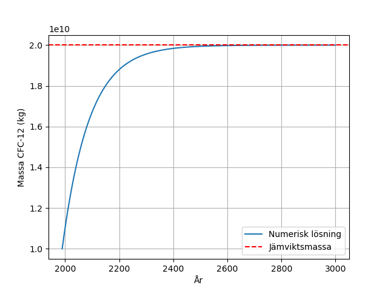
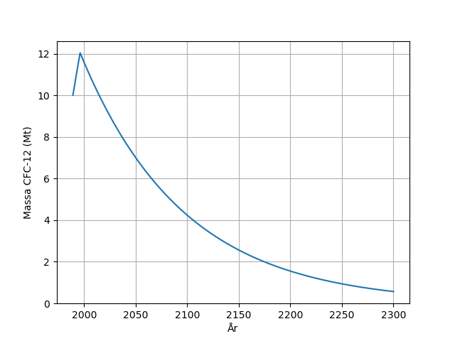
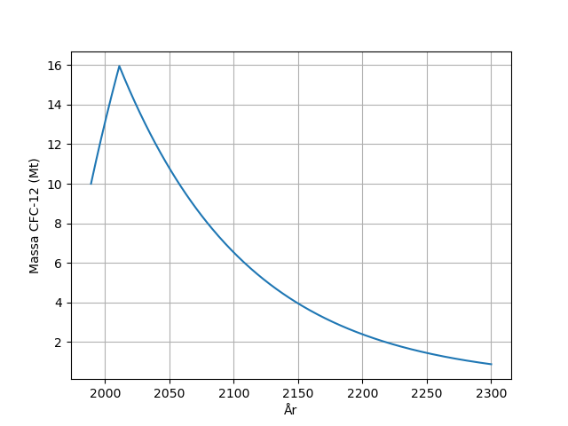

# Lösning till Inlämningsuppgift 3: Utfasning av freoner

Lösningsförslag och rättningsmall för Inlämning 3 i SEE060 Jorden som system.

## Fråga 1

### 1 a)

#### Svar

Vid jämvikt är $\frac{dm}{dt} = 0$, vilket ger (från Ekvation (1)):

$$
0 = E - \frac{m}{\tau} \Rightarrow m = E\tau = 2 \cdot 10^{8} \cdot 100 = 2 \cdot 10^{10}~\text{kg}.
$$

#### Rättningsmall

- Förklarar inte att dm/dt = 0 vid jämvikt.
- Ge fel och kommentar 1.

#### Vanliga kommentarer

1. Rätt, men vi förväntar oss lite mer förklaringar, t.ex. att dm/dt = 0 gäller vid jämvikt.
2. Rätt, men vi förväntar oss lite mer förklaringar, t.ex. varför dm/dt ska vara 0.

### 1 b)

### 1 c)

#### Svar

Eftersom utsläppstakten är större än nedbrytningstakten (p.g.a. den långa uppehållstiden) kommer massan freoner fortsätta öka.

#### Rättningsmall

- Säger att massan inte har nått jämvikt än.
  - Ge fel och kommentar 1.
- Säger att freoner inte hunnit brytas ner än eftersom uppehållstiden är 100 år.
  - Ge fel och kommentar 2.
- Säger att massan kommer öka så länge det finns utsläpp.
  - Ge fel och kommentar 3.
- Säger att det har med den långa uppehållstiden att göra, och att de gamla utsläppen fortfarande finns kvar.
  - Ge rätt och kommentar 4.

##### Vanliga kommentarer

1. Stämmer, men det förklarar inte varför jämviktsmassan är högre än massan år 1989 när utsläppen har minskat.
2. Du är inne på rätt spår. Notera dock att uppehållstiden anger ett medelvärde på livslängden - en del av freonerna bryts ner innan 100 år. Det handlar snarare om skillnaden mellan utsläppstakt och nedbrytningstakt. Om utsläppstakten är högre kommer massan fortsätta att öka.
3. Du är inne på rätt spår, men det beror även på utsläppstakten - om den är mindre än nedbrytningstakten (m/τ) kommer massan minska med tiden.
4. Delvis rätt, det har med den långa uppehållstiden att göra, men även med att utsläppstaken är större än nedbrytningstakten år 1989, vilket leder till att massan fortsätter öka.

## Fråga 2

### 2 a)

#### Rättningsmall

- Ingen enhet på y-axeln.
  - Ge fel och kommentar 1.
- Massa inte i Mt.
  - Ge fel och kommentar 2.

#### Vanliga kommentarer

1. Saknas enhet på y-axeln.
2. Massan ska vara i Mt.

### 2 b)

#### Automatisk rättad

12.04 Mt

### 2 c)

#### Automatisk rättad

2050

### 2 d)

#### Automatisk rättad

2244

## Fråga 3

### 3 a)

#### Rättningsmall

- Ingen enhet på y-axeln.
  - Ge fel och kommentar 1.
- Massa inte i Mt.
  - Ge fel och kommentar 2.

#### Vanliga kommentarer

1. Saknas enhet på y-axeln.
2. Massan ska vara i Mt.

### 3 b)

#### Automatisk rättad

15.95 Mt

### 3 c)

#### Automatisk rättad

2093

### 3 d)

#### Automatisk rättad

2287

### 3 e)

#### Svar

En 15-årig försening av Montrealprotokollet hade lett till en 43 års fördröjning innan ozonhålet försvinner och CFC-12 är borta ur atmosfären.
Dessutom hade den högsta halten av CFC-12 i atmosfären varit nästan 4 Mt (33%) högre jämfört med utan fördröjning.

#### Rättningsmall

- Anger inte exakt hur stora effekter/fördröjningar.
  - Ge fel och kommentar.

#### Vanliga kommentarer

1. Du kan kvantifiera hur stora skadar (hur större massa freoner?) och hur mycket längre tid för ozonhålet att försvinna/CFC-12 att vara borta ur atmosfären vid en fördröjning.
2. Med dina resultat kan du kvantifiera vad "betydligt längre tid" hade inneburit i det här fallet.
3. Med dina resultat kan du ge mer konkreta siffror på hur mycket det hade påverkat
